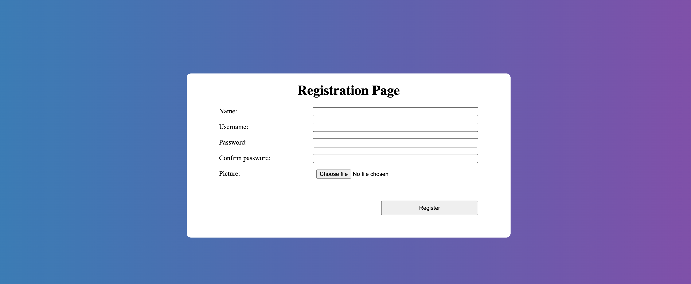
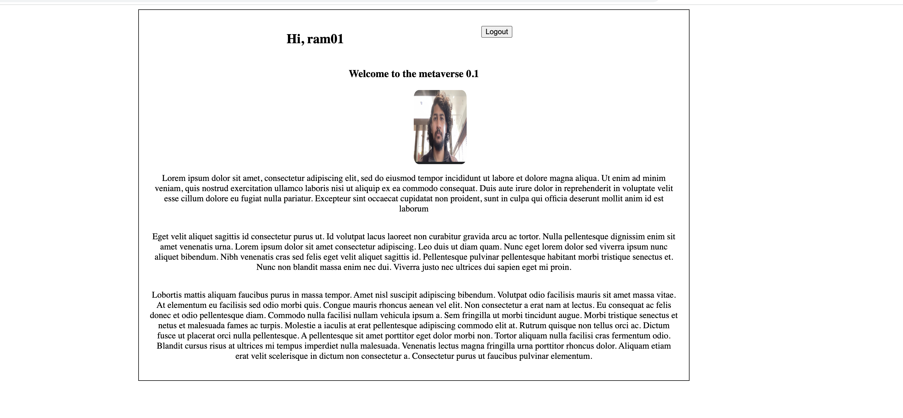

# php-authentication-101
Login, Logout and Registration and session implmented for the beginners.

## Frontend
HTML5, CSS3 And Vanilla JavaScript is used. 

## Backend
PHP is used.

## Database
mySQL is used.

## Getting started
1. Clone the repository in your /var/www/ directory. Mac users can clone to Library/WebServer/Documents.
2. Make sure apache is installed
3. Install mySQL (mysql_secure_installation is recommended)
4. Make sure PHP is installed (comes with lamp in linux and for mac - use homebrew)
5. Using VS Code is recommended but not necessary.

## Sample Pages

## Implementations done - 
[1]  Login
[2]  Logout
[3]  Registration
[4]  Authentication
[5]  Session maintained using PHP Session
[6]  Admin Panel for Adminstration

## Need to implement also
[1]  Profile Page CSS
[2]  Moving to CSS flexbox from positions
[3]  Ability to add friends
[4]  Scalability Testing

## Contributions
1. Sanjeev Prabhakar

## License
It is FOSS licensed under MIT License.
